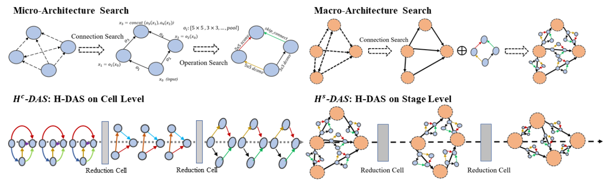
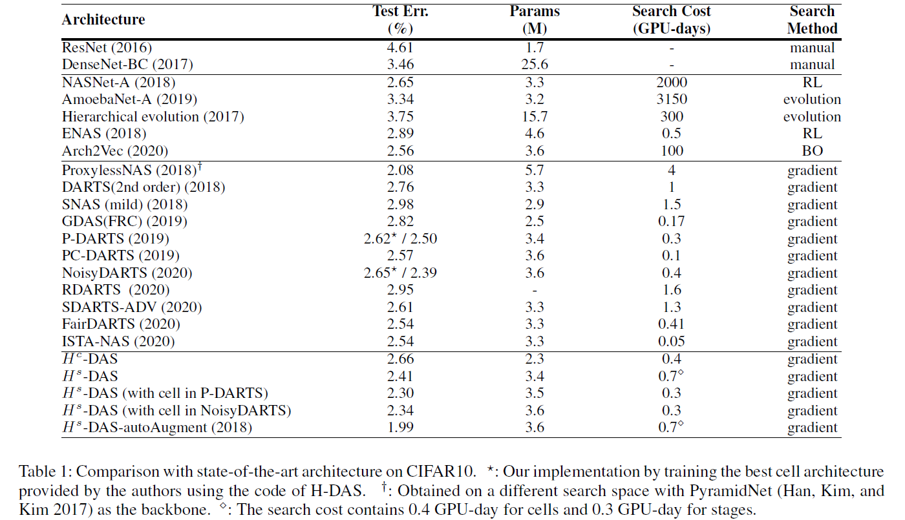
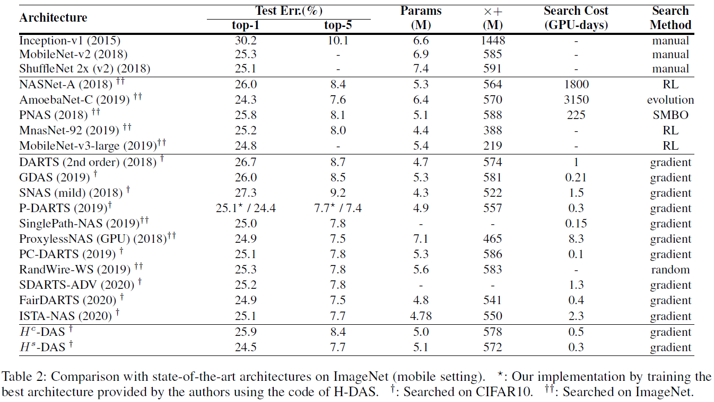
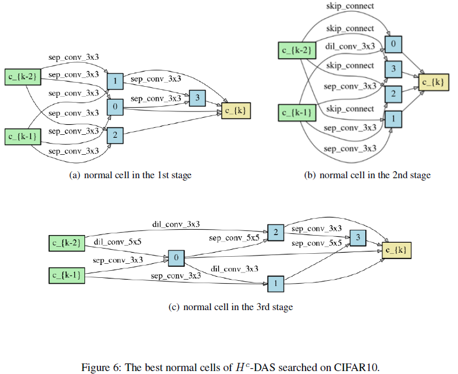
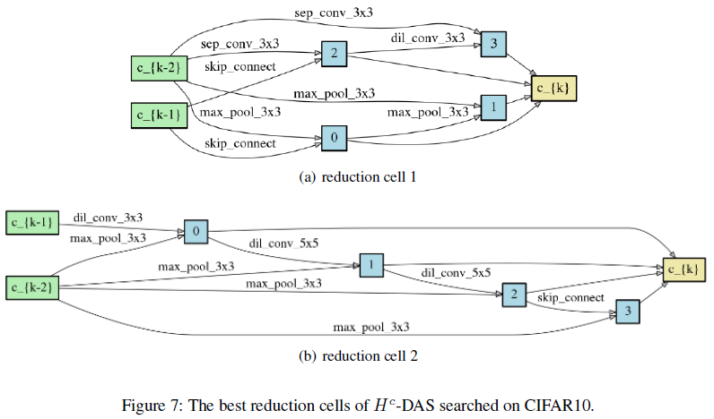
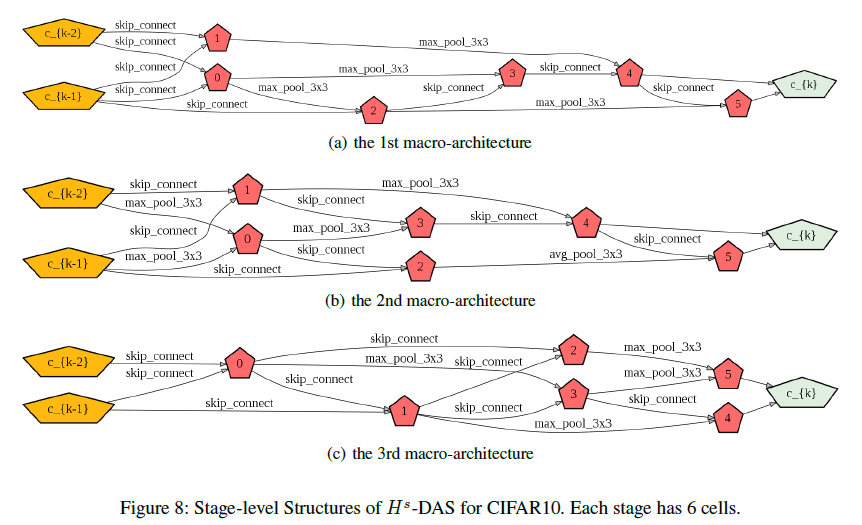
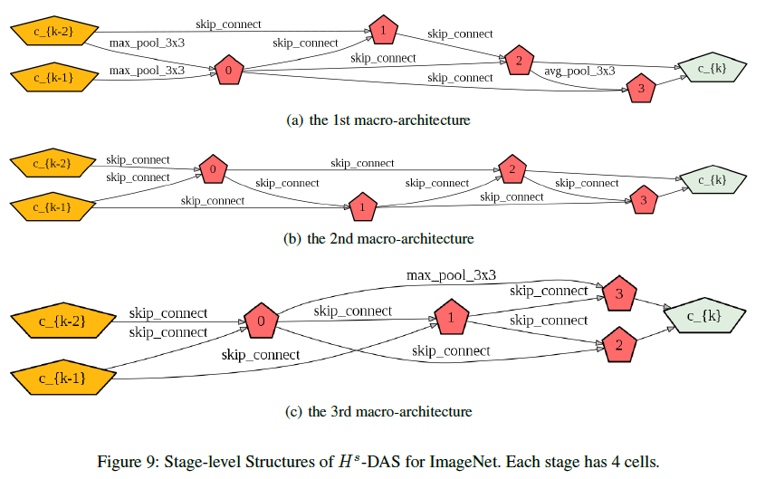

[](https://creativecommons.org/licenses/by-nc/4.0/)

# H-DAS: Unchain the Search Space with Hierarchical Differentiable Architecture Search

PyTorch implementation of [Unchain the Search Space with Hierarchical Differentiable Architecture Search](https://arxiv.org/abs/XXXX.xxxxx), supporting DDP (DistributedDataParallel) and [Apex](https://github.com/NVIDIA/apex) Amp (Automatic Mixed Precision).

## Framework



## Requirements

```shell
python>=3.6
pytorch>=1.4
tensorboardX
apex
numpy
graphviz
```

## Datasets

While CIFAR10 can be automatically downloaded by torchvision, ImageNet needs to be manually downloaded following the instructions [here](https://github.com/pytorch/examples/tree/master/imagenet).

## H<sup>c</sup>-DAS

### Search for three stage-specific normal cells and two reduction cells

Adjust the batch size if out of memory occurs. It depends on your gpu memory size and genotype.

- Search micro-architectures (cell-level structures)

```shell
python searchCell_main.py --name cifar10_test --dataset cifar10
```

- Augment micro-architectures (cell-level structures)

```shell
python augmentCell_main.py --name Hc-DAS  --dataset cifar10  \
--genotype "[Genotype3 searched by 'searchCell_main.py']"
```

- Run the following commands with DistributedDataParallel (ddp_version)

```shell
python -m torch.distributed.launch --nproc_per_node=8 \
ddp/augmentCell_main.py --name Hc-DAS  --dataset cifar10  \
--genotype "[Genotype3 searched by 'searchCell_main.py']"  --dist
```

## H<sup>s</sup>-DAS

### Search for macro-architectures with fixed cell structures.

##### Search macro-architectures (stage-level structures)

- Run the following commands to perform a stage-level structure search progress on CIFAR10.

```shell
python searchStage_main.py --name macro-cifar10-test \
--w_weight_decay 0.0027  --dataset cifar10 --batch_size 64 \
--workers 0  --genotype "[Genotype searched by DARTS or PDARTS or other Darts-series methods]"
```

- Run the following commands to perform a stage-level structure search progress for ImageNet

```shell
python searchStage_ImageNet_main.py --name macro-ImageNet-test  \
--dataset cifar10 --batch_size 128 --w_weight_decay 0.0027  \
--workers 16  --genotype "[Genotype searched by DARTS or PDARTS or other Darts-series methods]"
```

##### Augment macro-architectures (stage-level structures)

- Run the following commands to perform a stage-level structure augment progress on CIFAR10.

```shell
python augmentStage_main.py  --name Hs-DAS-cifar10-test  \
--init_channels 36  --workers 16 --lr 0.025  --batch_size 64 \
--dataset cifar10  --epochs 600  \
--genotype "[Genotype searched by DARTS or PDARTS or other Darts-series methods]"  \
--DAG "[Genotype2 searched by 'searchDAG_main.py']"
```

- Run the following commands with DistributedDataParallel (ddp_version)

```shell
python -m torch.distributed.launch --nproc_per_node=8  \
ddp/augmentStage_main.py  --init_channels 36 --workers 16 \
--name Hs-DAS-cifar10-test  --dataset cifar10 \
--genotype "[Genotype searched by DARTS or PDARTS or other Darts-series methods]" \
--DAG "[Genotype2 searched by 'searchDAG_main.py']" --dist
```

- Run the following commands to perform a stage-level structure augment progress on ImageNet.

```shell
python augmentStage_ImageNet_main.py  --init_channels 39 \
--batch_size 105  --lr 0.1  --workers 16  --dataset imagenet \
--name Hs-DAS_imagenet-test  --print_freq 100  --epoch 250 \
--genotype "[Genotype searched by DARTS or PDARTS or other Darts-series methods]" \
--DAG "[Genotype2 searched by 'searchDAG_ImageNet_main.py']"
```

- Run the following commands with DistributedDataParallel (ddp_version)

```shell
python -m torch.distributed.launch --nproc_per_node=8 \
ddp/augmentStage_ImageNet_main.py --init_channels 39 \
--workers 16 --name Hs-DAS-imagenet-test  --dataset imagenet  \
--print_freq 100  --epochs 250 \
--genotype "[Genotype searched by DARTS or PDARTS or other Darts-series methods]" \
--DAG "[Genotype2 searched by 'searchDAG_ImageNet_main.py']" --dist
```

We provide the augmentCell and augmentStage with DistributedDataParallel (ddp_version), but you should change some hyperparameters, such as lr and batch_size.

### Search for distribution of cells

The search of cell distribution over three stages is performed under a constraint of certain computational complexity.

- Run the following commands to search for the distribution of cells.

```shell
python searchDistribution_main.py --name cifar10-changeStage \
--w_weight_decay 0.0027  --dataset cifar10 --batch_size 64 --workers 0  \
--genotype "[Genotype searched by DARTS or PDARTS or other Darts-series methods]"
```

## Results

### Results on CIFAR10



### Results on ImageNet



### Searched micro-architectures

- normal cells (H<sup>c</sup>-DAS)

- reduction cells (H<sup>c</sup>-DAS)


### Searched macro-architectures

- macro-architectures of CIFAR10 (H<sup>s</sup>-DAS)

- macro-architectures of ImageNet (H<sup>s</sup>-DAS)


## Citations

Please cite our paper if this implementation helps your research. BibTex reference is shown in the following.

```latex
@inproceedings{liu2021hdas,
  title={Unchain the Search Space with Hierarchical Differentiable Architecture Search},
  author={Liu, Guanting and Zhong, Yujie and Guo, Sheng and Scott, Matthew R and Huang, Weilin},
  booktitle={AAAI},
  year={2021}
}
```

## Contact

For any questions, please fell free to reach:

```shell
github@malongtech.com
```

## License

H-DAS is CC-BY-NC 4.0 licensed, as found in the [LICENSE](LICENSE) file. It is released for academic research / non-commercial use only. If you wish to use for commercial purposes, please contact sales@malongtech.com.
